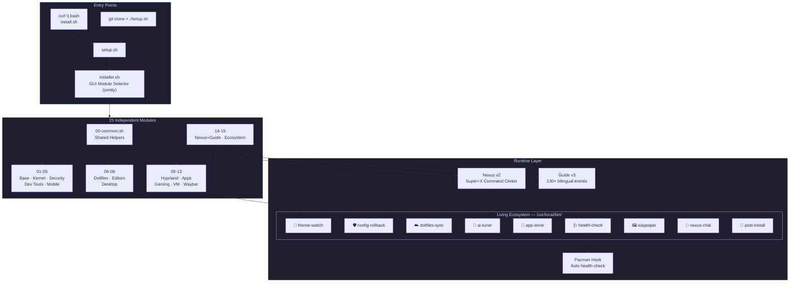

<p align="center">
  
</p>

<h1 align="center">🚀 CachyOS Workstation Setup</h1>

<p align="center">
  <strong>Modular, aesthetic, bilingual CachyOS development workstation installer.</strong>
</p>

<p align="center">
  
  
  
  
  
  
  
  <br/>
  <a href="https://github.com/anantaarthasejahtera/CachyOS-Workstation-Setup/actions/workflows/ci.yml">
    
  </a>
</p>

---

## ✨ Overview

A **modular installer** that transforms a fresh CachyOS installation into a fully configured, aesthetically stunning developer workstation. Auto-detects your hardware (GPU, RAM, CPU cores, Secure Boot) and adapts accordingly. **Safe on existing systems** — all configs are automatically backed up to `~/.config-backup/` before any changes.

Features:

- **GUI installer** — Catppuccin-themed zenity-based module selector with bilingual support (EN/ID) and progress bars
- **Nexus v2** — Smart command center popup with 45+ actions and live system stats
- **Guide v3** — 130+ searchable entries, executable, bilingual (EN/ID)
- **Living Ecosystem (v4)** — 9 integrated tools: theming, rollback, cloud sync, AI tuning, app store, health check, wallpaper picker, AI chat, post-install wizard
- **15 modules** — each independently runnable, fully idempotent
- **Hardware-aware** — GPU auto-detect, dynamic hugepages, Secure Boot MOK, GPU-scaled configs
- **Automated CI/CD** — Secure branch protection, Dependabot, and Automated GitHub Releases pipeline
- **Post-update safety** — Pacman hook auto-validates system after kernel/WM/GPU updates

### 🎯 Who Is This For?

| 🧑‍💻 Developers | 🎓 Students | 🎮 Gamers | 🧪 Tinkerers |
|:---:|:---:|:---:|:---:|
| Full-stack dev env | Free tools | Linux gaming | Learn Linux |
| 5 languages + Docker | No expensive software | Steam + emulators | Pre-configured |
| AI coding assistants | Mobile dev (Flutter) | MangoHud FPS overlay | Catppuccin everything |

---

<details>
<summary><b>📑 Table of Contents</b></summary>

- [✨ Overview](#-overview)
  - [🎯 Who Is This For?](#-who-is-this-for)
- [💻 System Requirements](#-system-requirements)
- [📦 Quick Start](#-quick-start)
- [🏗️ Project Structure](#-project-structure)
  - [Architecture](#architecture)
  - [Module Details](#module-details)
- [🌍 The Living Ecosystem (v4)](#-the-living-ecosystem-v4)
- [🎮 Nexus v2 — Command Center](#-nexus-v2--command-center)
- [📖 Guide v3 — Bilingual Reference](#-guide-v3--bilingual-reference)
- [⌨️ Key Shortcuts](#️-key-shortcuts)
- [🤖 AI Tools Included](#-ai-tools-included)
- [🔧 Configuration](#-configuration)
- [🔄 How to Revert / Uninstall](#-how-to-revert--uninstall)
- [🛡️ Hardware Compatibility & Resilience](#️-hardware-compatibility--resilience)
- [🤝 Contributing \& Support](#-contributing--support)
- [🙌 Acknowledgements](#-acknowledgements)
- [📄 License](#-license)

</details>

---

## 💻 System Requirements

| Tier | CPU | RAM | Storage | Use Case |
|------|-----|-----|---------|----------|
| **Minimum** | Any x86_64 | 4 GB | 20 GB free | Base system + shell + editors (no AI) |
| **Recommended** | 4+ cores | 16 GB | 50 GB free | Full install + 7B AI models + Docker + Android SDK |
| **AI Powerhouse** | 8+ cores | 32 GB | 80 GB free | Qwen3:30b MoE + DeepSeek-R1 + multiple models simultaneously |

> **Storage breakdown** (if all modules installed): Base ~2GB, Dev ~4GB, Mobile ~5GB, Gaming ~3GB, VM ~2GB, AI models ~20GB+, other modules ~2GB.
>
> **AI note**: The 7B models (qwen2.5-coder, deepseek-r1) run fine on 16GB RAM. The 30B Qwen3 model uses **Mixture of Experts (MoE)** — only ~3B parameters activate per inference, so it runs on 16GB but is more comfortable with 32GB.

---

## 📦 Quick Start

### ⚡ One-Liner Install (Recommended)

```bash
curl -fsSL https://raw.githubusercontent.com/anantaarthasejahtera/CachyOS-Workstation-Setup/main/install.sh | bash
```

> Auto-installs dependencies, prompts for your identity, and launches the GUI module selector.
>
> ⚠️ **Security note**: It is always a good practice to [inspect the install.sh script](https://github.com/anantaarthasejahtera/CachyOS-Workstation-Setup/blob/main/install.sh) before piping `curl` to `bash`. We encourage you to review the source first.

### 🔧 Manual Install

```bash
# Prerequisite: git must be installed (CachyOS ships with it by default)
# If not: sudo pacman -S git

# Clone
git clone https://github.com/anantaarthasejahtera/CachyOS-Workstation-Setup.git
cd CachyOS-Workstation-Setup

# The GUI wizard will prompt for your Git identity
# Or edit setup.sh / .env manually if you prefer

# Run (interactive module selector)
chmod +x setup.sh
./setup.sh

# Or install everything at once
./setup.sh --all
```

### GUI Module Selector

When you run `./setup.sh`, the zenity-based GUI installer guides you through module selection:

```
╔══════════════════════════════════════════════════════╗
║  📦 Select Modules                                   ║
╠══════════════════════════════════════════════════════╣
║  [x] 01  Base & GPU Drivers         [~2 GB]          ║
║  [x] 02  Kernel & Performance       [~0 MB]          ║
║  [x] 03  Security & Maintenance     [~50 MB]         ║
║  [x] 04  Dev Tools (Node,Py,Rust)   [~4 GB]          ║
║  [x] 05  Mobile Dev (Flutter)       [~5 GB]          ║
║  [x] 06  Shell & Dotfiles           [~100 MB]        ║
║  [x] 07  Editors (Antigravity)      [~700 MB]        ║
║  [x] 08  Desktop Theme (KDE)        [~300 MB]        ║
║  [x] 09  Hyprland WM                [~200 MB]        ║
║  [x] 10  Extra Apps                 [~500 MB]        ║
║  [ ] 11  Gaming (Steam, PCSX2)      [~3 GB]          ║
║  [ ] 12  Windows VM & Bottles       [~2 GB]          ║
║  [x] 13  Waybar Status Bar          [~5 MB]          ║
║  [x] 14  Nexus & Guide              [~1 MB]          ║
║  [x] 15  Living Ecosystem Utils     [~1 MB]          ║
║                                                      ║
║  Space = toggle  ·  Enter = confirm                  ║
╚══════════════════════════════════════════════════════╝
```

---

## 🏗️ Project Structure

```
CachyOS-Workstation-Setup/
├── install.sh                # One-liner bootstrap (curl | bash)
├── setup.sh                  # Main entry point (edit config here)
├── installer.sh              # GUI installer (zenity-based)
├── uninstall.sh              # Safe ecosystem remover
├── Makefile                  # Dev commands (install, lint, init)
├── CHANGELOG.md              # Release history
├── ecosystem/                # Living Ecosystem (12 tools)
│   ├── nexus.sh              # Nexus v2 Command Center (Super+X)
│   ├── nexus-chat.sh         # AI chat session launcher
│   ├── guide.sh              # Guide v3 — bilingual reference (EN/ID)
│   ├── theme-switch.sh       # Dynamic Catppuccin flavor hot-swapper
│   ├── config-rollback.sh    # Time Machine config restoration GUI
│   ├── dotfiles-sync.sh      # Cloud Git sync for ~/.config
│   ├── ai-tuner.sh           # Local AI system telemetry analysis
│   ├── ai-power-fix.sh       # GPU power state fix for AI inference
│   ├── app-store.sh          # Curated GUI App Store (Pacman/AUR)
│   ├── health-check.sh       # Post-update system integrity validator
│   └── post-install.sh       # First-boot post-install wizard
├── modules/
│   ├── 00-common.sh          # Shared functions & helpers
│   ├── 01-base.sh            # GPU auto-detect, paru, makepkg
│   ├── 02-kernel.sh          # sysctl, NVMe, THP, Zram
│   ├── 03-security.sh        # UFW, SSH key, DNS, auto-cleanup
│   ├── 04-dev.sh             # Docker, Node, Python, Rust, Go
│   ├── 05-mobile.sh          # Flutter, Android SDK, Kotlin
│   ├── 06-dotfiles.sh        # Kitty, Fish, Starship, fzf
│   ├── 07-editors.sh         # Antigravity, Neovim, Ollama
│   ├── 08-desktop.sh         # KDE Catppuccin, GRUB theme
│   ├── 09-hyprland.sh        # WM config, keybinds, lock screen
│   ├── 10-apps.sh            # Browser, tmux, Bluetooth, Native Apps
│   ├── 11-gaming.sh          # Steam, PCSX2, PrismLauncher, MangoHud
│   ├── 12-vm.sh              # QEMU/KVM, Bottles, LibreOffice
│   ├── 13-waybar.sh          # Status bar config + CSS
│   ├── 14-nexus-guide.sh     # Installs Nexus + Guide
│   └── 15-ecosystem.sh       # Installs Living Ecosystem Utilities
├── .github/                  # Community Health & CI Workflows
│   ├── CODE_OF_CONDUCT.md
│   ├── CONTRIBUTING.md
│   ├── INSTALL_GUIDE.md
│   ├── SECURITY.md
│   └── SUPPORT.md
├── .githooks/                # Local development Git hooks
│   └── pre-commit            # Pre-commit checks (ShellCheck, syntax)
├── assets/                   # Bundled wallpapers and static assets
│   └── wallpapers/           # Catppuccin-themed wallpapers
├── docs/                     # Official VitePress documentation source
├── .gitignore
└── .gitattributes            # Enforce LF line endings for .sh files
```

### Architecture



### Module Details

| # | Module | Size | Key Tools |
|---|--------|------|-----------|
| 01 | Base & GPU | ~2 GB | GPU auto-detect (Intel/AMD/NVIDIA), Secure Boot MOK, paru, base-devel |
| 02 | Kernel | ~0 MB | sysctl tuning, NVMe optimization, THP, GuC/HuC |
| 03 | Security | ~50 MB | UFW, SSH key (ed25519), Cloudflare DNS, Zram, Timeshift |
| 04 | Dev Tools | ~4 GB | Docker, Node/fnm/pnpm, Python/uv, Rust, Go, lazygit, CLI power tools |
| 05 | Mobile | ~5 GB | Flutter, Android SDK (API 34), Kotlin, JDK 17, scrcpy |
| 06 | Dotfiles | ~100 MB | Kitty, Fish shell, Starship prompt, fzf |
| 07 | Editors | ~700 MB | [Antigravity](https://antigravity.google/blog) (Google's AI-powered VS Code fork), Neovim (lazy.nvim) |
| 08 | Desktop | ~300 MB | KDE Catppuccin theme, GRUB theme, Inter + Nerd Fonts |
| 09 | Hyprland | ~200 MB | Tiling WM, keybinds, Rofi, Hyprlock, Hypridle |
| 10 | Apps | ~500 MB | Zen Browser, tmux, Spotify/Telegram/Discord (Native Arch/AUR packages) |
| 11 | Gaming | ~3 GB | Steam (Proton), PCSX2 (GPU-aware config), PrismLauncher, Roblox, MangoHud |
| 12 | VM | ~2 GB | QEMU/KVM via qemu-desktop (hugepages, CPU pinning), Bottles, LibreOffice |
| 13 | Waybar | ~5 MB | Glassmorphism status bar with gradient CSS |
| 14 | Nexus + Guide | ~1 MB | Smart command center + 130+ entry bilingual guide |
| 15 | Ecosystem | ~1 MB | Theme Engine, Config Rollback, Dotfiles Sync, AI Tuner, App Store, Health Check, Waypaper, AI Chat, Post-Install |

---

## 🌍 The Living Ecosystem (v4)

The project has evolved into a "Living Ecosystem" with 9 integrated pillars, completely transforming how you manage your Arch setup. All features are natively integrated into the **Nexus Command Center (`Super+X`)**.

### 1. 🎨 Dynamic Theming Engine (`theme-switch`)
Ditch hardcoded palettes. Seamlessly swap between Catppuccin flavors (Mocha, Macchiato, Frappe, Latte), Dracula, Tokyo Night, and Rosé Pine.
- Automatically hot-reloads Hyprland window borders, Rofi UI, Waybar CSS, Kitty terminals, and Dunst notifications **instantly**.

### 2. 🛡️ Time Machine (`config-rollback`)
Never fear breaking your config. 
- Using a beautiful Rofi UI, browse timestamped backups automatically created by the `safe_config()` macro.
- Restore single file overrides (e.g., `waybar/style.css`) or revert entire snapshots.

### 3. ☁️ Dotfiles Cloud Sync (`dotfiles-sync`)
Your customizations, instantly portable.
- Quickly pushes your `~/.config/` directory to a private external Git repository (like GitHub).
- Features a strict `.gitignore` tailored specifically for CachyOS to omit heavy caches (e.g., `.git/`, `.cache/`, `Nextcloud/`, `op/`).

### 4. 🧠 AI Auto-Tuner (`ai-tuner`)
Local AI system telemetry auditing.
- Takes dynamic snapshots of `top`, `free -h`, and `vmstat`.
- Pipes telemetry via the standard Ollama API directly into `qwen2.5-coder:7b` to get actionable system optimization advice displayed neatly in a Rofi UI.

### 5. 🏪 Aesthetic GUI App Store (`app-store`)
Visual package management elevated.
- A curated multi-tiered Rofi menu categorized by Browsers, Development, Gaming, Design, and Utilities.
- Automates the backend execution of `sudo pacman` or `paru` intelligently for each app without forcing the user to touch the terminal.

### 6. 🩺 System Health Check (`health-check`)
Post-update system integrity validator.
- Checks GPU driver status, Hyprland/Waybar config syntax, critical packages, kernel module integrity, services, backups, and disk space.
- **Pacman hook**: Auto-runs after kernel, Hyprland, Waybar, or NVIDIA updates — you'll see the health report right in your terminal after `pacman -Syu`.
- Also available via **Nexus** → System Health Check, or terminal: `health-check`.

### 7. 🖼️ Wallpaper Picker (`waypaper`)
Visual wallpaper selection.
- Browse and apply wallpapers via the Waypaper GUI.
- Integrated with Hyprpaper for persistence across reboots.

### 8. 💬 Nexus AI Chat (`nexus-chat`)
Interactive local AI chat.
- Select from installed Ollama models (qwen3, deepseek-r1, qwen2.5-coder) via Rofi.
- Choose mode: Normal Chat, Debate Mode, or Terminal Access.
- Auto-starts Ollama service if needed, manages CPU power governor.

### 9. 🧙 Post-Install Wizard (`post-install`)
First-boot onboarding.
- Syncs dotfiles, sets wallpaper, verifies ecosystem tools are working.
- Runs automatically after first install, or invoke manually: `post-install`.

---

## 🎮 Nexus v2 — Command Center

Press **`Super+X`** for a smart popup with **live system stats**:

```
╭── 🔍 Nexus ───────────────────────────────────╮
│  Super+X · 󰁹 87% · 󰍛 4.2/16GB                 │
│───────────────────────────────────────────────│
│  ── 󰁹 87%  │  󰍛 4.2/16GB  │  󰋊 420G free ──   │
│  ──────────────────────────────────────────── │
│    System Update (pacman)                     │
│    Cleanup Packages & Cache                   │
│  ──────────────────────────────────────────── │
│    Screenshot — Region                        │
│    Record Screen (or ⏹ Stop if recording)     │
│  ──────────────────────────────────────────── │
│  󰧑  AI Chat — Reasoning (qwen3) 🟢            │
│    Docker Manager 🟢                          │
│    VM Manager 🔴                              │
│  ──────────────────────────────────────────── │
│  🏪  GUI App Store (Browse & Install)         │
│  🎨  Dynamic Theme Switcher                   │
│  🛡️  Time Machine (Config Rollback)           │
│  ☁️  Dotfiles Cloud Sync                      │
│  🧠  AI Auto-Tuner                            │
│  🩺  System Health Check                      │
│  ───────────────────────────────────────────  │
│    Guide Popup (130+ entries)                 │
╰───────────────────────────────────────────────╯
```

### Nexus Features

| Feature | Description |
|---------|-------------|
| **Live system stats** | Battery %, RAM usage, disk free, CPU temp in header |
| **Smart recording** | Auto-detects if recording → shows Stop instead of Record |
| **Service status** | 🟢/🔴 indicators for Docker, Ollama, VMs |
| **Dynamic detection** | Only shows apps that are actually installed |
| **45+ actions** | Quick actions, AI, dev tools, apps, gaming, system, health check |
| **Zero RAM idle** | Only runs when invoked |

---

## 📖 Guide v3 — Bilingual Reference

```bash
# Interactive mode (fzf + preview pane + executable)
guide

# Filter by keyword
guide docker       # Docker commands
guide flutter      # Flutter commands
guide hyprland     # Keyboard shortcuts
guide ai           # Ollama commands

# Popup mode (rofi, integrated with Nexus)
guide --popup

# Online reference (cheat.sh)
guide --web tar

# Switch language
guide --lang id    # 🇮🇩 Bahasa Indonesia
guide --lang en    # 🇬🇧 English
```

### Guide Features

| Feature | Description |
|---------|-------------|
| **130+ entries** | 18 categories (hyprland, shell, git, docker, node, python, rust, go, flutter, editor, ai, gaming, vm, apps, system, ecosystem, terminal, record) |
| **Executable** | Press Enter on any ▶ entry to run the command directly |
| **Preview pane** | fzf right panel shows detailed explanation + examples |
| **Bilingual** | Full English and Indonesian translations (auto-detected from locale) |
| **Popup mode** | Rofi popup via `guide --popup` or from Nexus |
| **cheat.sh** | Online fallback via `guide --web <topic>` |
| **Language persist** | Choice saved to `~/.config/guide-lang` |

### Example (Bahasa Indonesia)

```
━━━ Guide: docker ━━━  [bahasa: Indonesia]

  [docker] ▶ docker ps
         → Daftar container berjalan
         Tampilkan container berjalan dengan port, nama, status

  [docker] ▶ lazydocker
         → Manajer Docker TUI
         UI terminal cantik: container, image, volume, log
```

---

## ⌨️ Key Shortcuts

| Shortcut | Action |
|----------|--------|
| `Super + X` | **Nexus Command Center** (smart popup) |
| `Super + Return` | Terminal (Kitty) |
| `Super + D` | App launcher (Rofi) |
| `Super + Q` | Close window |
| `Super + F` | Fullscreen |
| `Super + L` | Lock screen (Hyprlock) |
| `Super + E` | File manager (Thunar) |
| `Super + V` | Clipboard history (cliphist via Rofi) |
| `Super + N` | Notification history (dunstctl) |
| `Super + /` | Keybind cheatsheet |
| `Super + Shift+S` | Screenshot (region) |
| `Super + M` | Exit Hyprland (logout) |
| `Super + 1-9` | Switch workspace |

---

## 🤖 AI Tools Included

All models run **100% locally** via [Ollama](https://ollama.com) — no cloud, no API keys, no data leaving your machine.

| Model | Type | Purpose | RAM Required | Disk | Command |
|-------|------|---------|-------------|------|---------|
| `qwen3:30b-a3b` | **MoE** (3B active / 30B total) | Reasoning, debate, strategy, philosophy | 16GB min, 32GB ideal | ~18GB | `ollama run qwen3:30b-a3b` |
| `deepseek-r1:7b` | Dense 7B | Chain-of-thought math & logic reasoning | 8GB min | ~5GB | `ollama run deepseek-r1:7b` |
| `qwen2.5-coder:7b` | Dense 7B | Code generation, refactoring, debugging | 8GB min | ~5GB | `ollama run qwen2.5-coder:7b` |

<details>
<summary>💡 What is MoE (Mixture of Experts)?</summary>

Qwen3:30b uses a **Mixture of Experts** architecture — the model has 30 billion total parameters, but only ~3 billion activate per inference. This means:
- **Speed**: Generates at near-7B speed despite being a 30B model
- **Quality**: Produces 30B-quality outputs (comparable to GPT-4o in reasoning tasks)
- **RAM**: Only loads the active expert parameters, so it fits in 16GB RAM
- **Trade-off**: Needs ~18GB disk space for the full model weights

This is why we chose it over a regular 30B dense model — you get flagship-tier reasoning on consumer hardware.
</details>

All accessible via **Nexus** → AI section, or terminal `ollama run <model>`.

---

## 🔧 Configuration

Each module sources `modules/00-common.sh` which provides:

- **Safe configs** — `safe_config()` auto-backs up to `~/.config-backup/` before every overwrite
- **Idempotent** — Re-run any module safely without side effects
- **Smart installs** — Packages checked before install (no reinstalling)
- **Hardware-aware** — GPU, RAM, CPU cores, and Secure Boot detected automatically
- **Logging** — Everything logged to `~/cachy-setup.log`
- **Run individual modules** — `bash modules/04-dev.sh` (test one module)
- **Post-update safety** — Pacman hook runs `health-check` after critical updates

---

## 🔄 How to Revert / Uninstall

Every configuration change made by the setup script is automatically backed up before overwriting. You can restore your system at any time.

### Via GUI (Time Machine)

Launch from **Nexus** (`Super+X` → Time Machine) or terminal:

```bash
config-rollback
```

### Via Uninstaller Script (Graceful Removal)

We provide a dedicated cleanup script that safely removes the Nexus command center, interactive guides, ecosystem binaries, custom Rofi UI themes, and Pacman hooks without deleting your personal files or touching core packages.

```bash
./uninstall.sh
```

### Via CLI (Manual Rollback)

```bash
# 1. List available backups (sorted by date)
ls -lt ~/.config-backup/

# 2. Restore a specific backup
cp ~/.config-backup/20250307-143025/waybar__style.css ~/.config/waybar/style.css

# 3. Or restore everything from a snapshot
for f in ~/.config-backup/20250307-143025/*; do
    real_path=$(basename "$f" | sed 's|__|/|g')
    cp "$f" "$real_path"
done

# 4. Reload affected services
killall -SIGUSR2 waybar 2>/dev/null
hyprctl reload 2>/dev/null
```

### Uninstalling packages

The setup script uses standard `pacman` and `paru`. To remove any installed package:

```bash
# Remove a package and its unused dependencies
sudo pacman -Rns <package-name>

# Check the install log for what was installed
cat ~/cachy-setup.log | grep "Installing"
```

> 💡 The setup script **never modifies system partitions, bootloaders (beyond GRUB theme), or critical system files**. All changes are confined to user-space configs (`~/.config/`) and standard package installation.

---

## 🛡️ Hardware Compatibility & Resilience

### 🖥️ Hardware Auto-Detection

The setup script adapts to your hardware automatically via `lspci`, `/proc/meminfo`, and `mokutil`:

| Scenario | How We Handle It | Status |
|----------|------------------|--------|
| **Different GPU** (Intel → AMD → NVIDIA) | `01-base.sh` auto-detects and installs correct drivers | ✅ Handled |
| **CPU core count varies** (2→4→16 cores) | CPU pinning in `12-vm.sh` checks `nproc` first | ✅ Handled |
| **Low RAM** (4-8 GB) | Hugepages scale dynamically: 2GB/1GB/skip based on available RAM | ✅ Handled |
| **Multi-monitor setup** | Hyprland auto-detects monitors — no hardcoded resolutions | ✅ Handled |
| **PCSX2 GPU-specific settings** | Auto-detects discrete vs integrated GPU, scales upscale/AF accordingly | ✅ Handled |
| **Secure Boot enabled** | NVIDIA DKMS auto-detects Secure Boot, generates MOK key, and guides enrollment | ✅ Handled |

### 🔄 Rolling Release Resilience

CachyOS is a rolling release. System updates are automatically safeguarded with 5 defense layers:

```
Layer 1: safe_config()   → Auto-backup before every config change
Layer 2: config-rollback → Rofi GUI to restore any backup (Super+X → Time Machine)
Layer 3: dotfiles-sync   → Cloud Git sync for disaster recovery
Layer 4: Idempotent      → Re-run any module to re-apply: bash modules/09-hyprland.sh
Layer 5: health-check    → Pacman hook auto-validates after kernel/WM/GPU updates
```

After `pacman -Syu`, the health check automatically runs and detects issues. Recovery is straightforward:

| Scenario | Auto-Detected | Recovery |
|----------|:---:|----------|
| Hyprland config syntax change | ✅ via `health-check` | `bash modules/09-hyprland.sh` |
| Waybar widget API change | ✅ via `health-check` | `bash modules/13-waybar.sh` |
| Kernel module missing after update | ✅ via `health-check` | Reboot (new kernel loads automatically) |
| Package renamed upstream | ⚠️ Manual | Edit module, replace package name |

**Unaffected by updates:**
- All backed-up configs (`~/.config-backup/`)
- Cloud-synced dotfiles (Git history preserved)
- Package installations (pacman tracks dependencies)
- The setup scripts themselves (idempotent, re-runnable)

> 💡 **Pro tip**: Run `sudo pacman -Syu` regularly (or via Nexus → System Update). Small, frequent updates are safer than waiting months.

---

## 🤝 Contributing

We welcome contributions! See [CONTRIBUTING.md](.github/CONTRIBUTING.md) for detailed guidelines.

```bash
git checkout -b feature/your-idea
# Edit any module in modules/
git commit -m "feat: add your awesome feature"
git push origin feature/your-idea
# Open a Pull Request
```

Each module is **independent** — you can edit one without touching others.

### Community & Support

| Document | Description |
|----------|-------------|
| [CONTRIBUTING.md](.github/CONTRIBUTING.md) | How to contribute, coding conventions, testing |
| [SUPPORT.md](.github/SUPPORT.md) | Where to get help, report bugs, ask questions |
| [CODE_OF_CONDUCT.md](.github/CODE_OF_CONDUCT.md) | Community behavior standards |
| [SECURITY.md](.github/SECURITY.md) | Vulnerability reporting & security policy |

---

## 🙌 Acknowledgements

This ecosystem stands on the shoulders of giants. We would like to express our profound gratitude to:
- The [CachyOS Team](https://cachyos.org) for creating an incredibly performant Arch-based foundation.
- [Vaxry](https://github.com/vaxerski) and the [Hyprland Community](https://hyprland.org) for redefining Linux window management.
- The [Catppuccin](https://github.com/catppuccin/catppuccin) team for providing the aesthetic color palettes that define this ecosystem's visuals.
- The [Ollama](https://ollama.com) community for making local AI inference accessible on consumer hardware.

---

## 📄 License

GPL-3.0 © 2026 [PT Ananta Artha Sejahtera](https://anartha.com) — see [LICENSE](LICENSE).

---

<p align="center">
  <sub>Built with ❤️ by <a href="https://anartha.com">PT Ananta Artha Sejahtera</a></sub><br/>
  <sub><a href="https://github.com/catppuccin/catppuccin">Catppuccin</a> · <a href="https://cachyos.org">CachyOS</a> · <a href="https://hyprland.org">Hyprland</a></sub>
</p>
